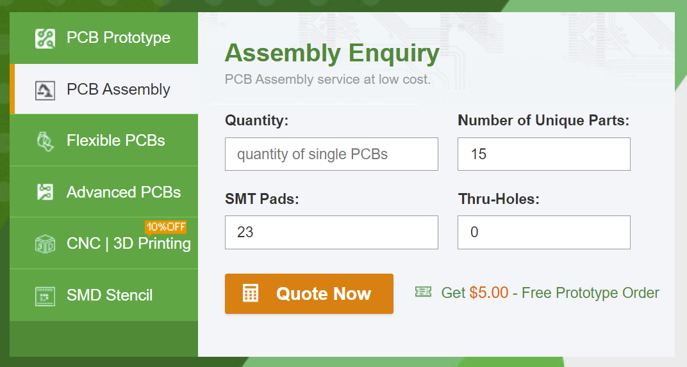

# How to Order the iC-MHM Encoder:

#### The PCBs are designed to PCBWay's 4-Layer stackup, any thickness from 0.6mm to 2.4mm. 
#### If ordered elsewhere, please confirm that the layer thicknesses are correct before ordering to acheive the correct differential impedances

## For an assembly order, enter the following:
15 Unique Components  
23 SMD Components total  
0 Thru-Hole components  

  

### See readme in V1 folder for PCB options, but remember the following changes:
### The size of the PCB is now 63mm x 58mm (not 68x58)
### The thickness can be anything from 0.6mm to 2.4mm now
### the stencil doesnt apply for an assembly order

### Make sure to upload both the BOM and the zip file which contains the gerbers and the PnP files

