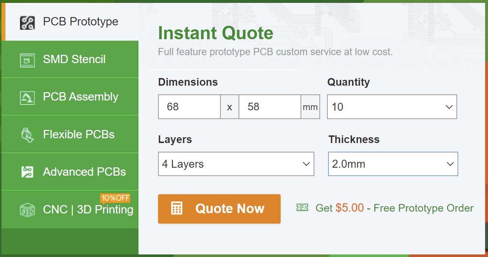
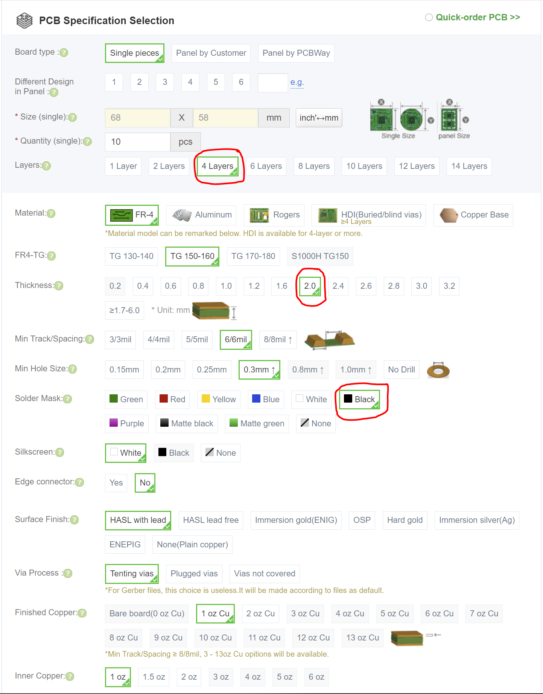
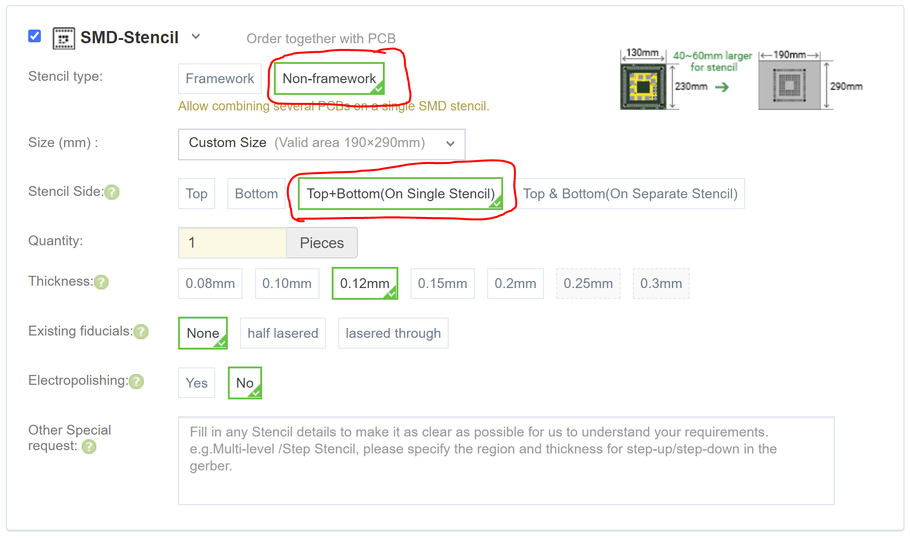
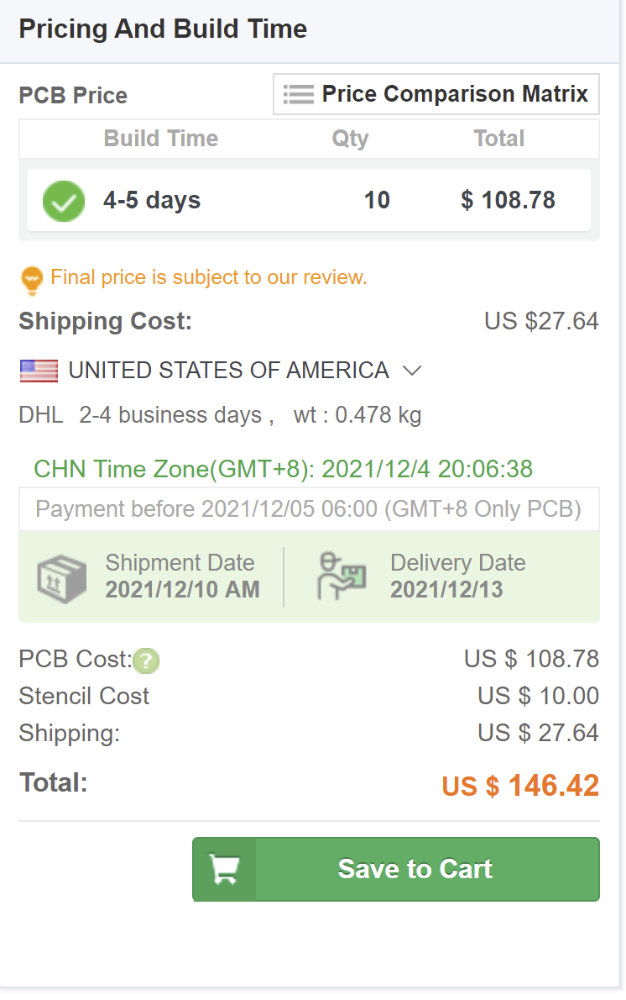

# How to Order the iC-MHM Encoder:

<b>
The PCBs are designed to PCBWay's 4-Layer 2mm stackup. If ordered elsewhere, please confirm that the layer thicknesses are correct before ordering to acheive the correct differential impedances.
</b>
<h2>On the first page of PCBway, enter the following:

  

On the ordering page, make sure to select 2mm, and choose the color black if you don't want a lame green pcb

  

Make sure to order a stencil, and that you select Top+Bottom. I find that without framework is easier to use.

  

This should be the approximate cost if entered correctly, based on data from 12/4/21

  </h2>

